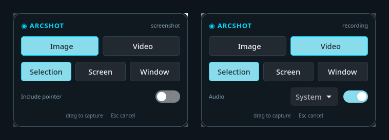

# Arcshot

A screenshot and screen-recording overlay for **Hyprland** and other wlroots
compositors. Press your capture key, pick what you want, done — and it
remembers what you picked last time.



It is the GNOME screenshot flow, on Wayland, without GNOME.

---

## What it does

- **The screen is live the moment it opens.** Press the key and drag a region
  straight away — no picking a mode, no shutter button.
- **The toolbar stays usable while the screen is live.** Normal cursor over the
  toolbar, crosshair everywhere else, and the buttons actually click, so you
  can switch to video / screen / window without cancelling first.
- **Screen and window capture as soon as you pick them.** Selection is the only
  mode that waits for a gesture. A **Capture** button fires the same thing again
  without switching modes.
- **It never appears in its own capture.** Not the toolbar, not the dim, not the
  countdown — whatever you were looking at is what you get.
- **A timer** (3s / 5s / 10s) when you need a moment first. The overlay shrinks
  to a small badge and hands the keyboard back to the desktop, so you can open
  a menu or park the pointer while it counts down.
- **Recordings get real controls**: Pause / Resume, Mic, System sound, Stop and
  an elapsed clock — placed where the recording cannot film them.
- **Pause actually pauses.** The paused seconds are not in the finished file.
- **Mic and system sound are separate, and switch mid-recording.** Record both,
  either, or neither, and change your mind while it is rolling.
- **Image or video**, **whole screen / region / window**.
- **Include the pointer or not** on screenshots.
- **Remembers your last choice**, so the common case is press-key, drag.
- Screenshots land on the **clipboard** as well as on disk.
- Optional hand-off to **swappy** for annotation.

## Install

```bash
git clone https://github.com/sarbojitrana/arcshot.git
cd arcshot
./install.sh
```

Installs to `~/.local` (no root). `sudo ./install.sh --system` puts it in
`/usr/local` instead; `./install.sh --uninstall` removes it.

Then bind it. In `~/.config/hypr/conf/custom.conf`:

```
bind = , Print,      exec, arcshot                # overlay, selection armed
bind = SUPER, Print, exec, arcshot --shot screen  # whole screen, no overlay
bind = SUPER, P,     exec, arcshot --pause        # pause/resume a recording
```

Note that the key runs the **installed** copy in `~/.local`, not your checkout.
After changing anything, run `./install.sh` again or the key will keep running
the old version.

## Requirements

| | |
|---|---|
| **Required** | `python-gobject` (GTK 4 + libadwaita), `gtk4-layer-shell`, `grim`, `slurp` |
| **Recording** | `wf-recorder`, plus `ffmpeg` to join the parts of a paused recording |
| **Recording audio** | PipeWire or PulseAudio, for `pactl` |
| **Clipboard** | `wl-clipboard` |
| **Notifications** | `libnotify` |
| **Annotation** (optional) | `swappy` |

On Arch:

```bash
sudo pacman -S python-gobject gtk4 libadwaita gtk4-layer-shell grim slurp wf-recorder ffmpeg wl-clipboard libnotify swappy
```

The installer checks all of these and tells you which optional features you'd
be missing before it writes anything.

## Command line

The GUI is optional — every mode has a flag, so you can bind them directly.

```
arcshot                 open the capture overlay, or stop an active recording
arcshot --stop          stop an active recording
arcshot --pause         pause or resume an active recording
arcshot --shot AREA     screenshot now      (screen | region | window)
arcshot --rec  AREA     start recording now (screen | region | window)
arcshot --status        prints 'recording', 'paused' or 'idle'
```

`--status` is there so you can put a recording indicator in your bar. A waybar
module:

```json
"custom/arcshot": {
  "exec": "arcshot --status",
  "interval": 2,
  "format": "{}",
  "on-click": "arcshot --stop",
  "on-click-right": "arcshot --pause"
}
```

## Configuration

`~/.config/arcshot/config.json`, written whenever you capture from the GUI:

```json
{
  "mode": "image",
  "area": "region",
  "mic": false,
  "system_audio": false,
  "timer": 0,
  "cursor": false,
  "copy_to_clipboard": true,
  "open_editor": false,
  "image_dir": "",
  "video_dir": ""
}
```

`timer` is in seconds; `0` is off. `image_dir` / `video_dir` default to your XDG
Pictures and Videos folders plus `Screenshots` / `Recordings`. Set
`open_editor` to `true` to have every screenshot open in swappy.

Older configs with `audio` / `audio_source` are carried over to `mic` and
`system_audio` the first time they are read.

## Notes on how it works

**Stopping a recording never loads GTK.** The "is something already recording?"
check happens in `__main__` before the UI is imported, so the stop path is a
PID check and a signal.

**Recordings are stopped with `SIGINT`, not `SIGTERM`.** `wf-recorder` needs the
interrupt to finalise the MP4 container; killing it any other way leaves a
truncated file that most players refuse.

**The overlay draws its own selection instead of shelling out to `slurp`.**
That is not gold-plating. `slurp` takes the pointer for the entire screen, so
with it armed the toolbar buttons cannot be clicked and the crosshair follows
you over the toolbar — there is no way to change mode without cancelling first.
Owning the surface means the canvas gets a crosshair, the toolbar keeps a normal
cursor, and both work at once.

The layout is one fullscreen `gtk4-layer-shell` surface on the `overlay` layer
holding a `Gtk.Overlay`: a `DrawingArea` painting the dim and selection, with the
toolbar floated on top. `slurp` is still used by the `--shot` / `--rec` CLI
flags, where there is no toolbar to compete with.

**Window selection** asks Hyprland for the geometry of every window on the
current workspace. In the overlay you hover one and it lights up; the target is
resolved at the moment the shutter fires, so with a timer running you can walk
the pointer somewhere else first. On a compositor without `hyprctl` it falls
back to region select.

**Keeping the overlay out of the shot is not a matter of hiding it.** Unmapping
a layer surface starts the compositor's close animation — Hyprland fades layers
out over 450ms by default, and it is a user setting — so `grim` ends up
photographing a half-faded toolbar. The surface therefore stays mapped and is
*emptied* instead: rows hidden, the bar's own box blanked, the canvas painting
nothing. Then it waits for a frame that provably contains that change (the
frame *counter* has to move; the next `after-paint` may belong to a frame drawn
before it) and only then takes the picture.

**The recording controls are put where the recording cannot see them.**
`wf-recorder` films whatever the compositor puts inside the rectangle, so the
bar is anchored to the first corner that does not intersect it — bottom-centre
first, so most recordings never see it move. A whole-screen recording leaves no
free corner, so the frame is trimmed by the bar's strip instead (1920x1080
records as 1920x948). Only the full-screen case is trimmed: a region or a
window is a rectangle you chose, and shrinking that quietly would be rude.

**Pause is stop-and-start.** `wf-recorder` cannot pause, so each run is a
segment and the segments are concatenated with `ffmpeg -c copy` when you stop.
The paused seconds cost nothing in the finished file.

**Audio always comes from a null sink arcshot owns.** `wf-recorder` takes one
`--audio` device and cannot be re-pointed while running, so recording the
microphone or the speakers directly would freeze that choice for the whole
recording and could never mix both. Instead it records a sink of ours, and the
Mic / Sound buttons load and unload loopbacks into it — the device
`wf-recorder` was handed never changes. Everything is torn down on stop.

Four traps worth writing down:

- `gtk4-layer-shell` must be linked *before* `libwayland-client`, which Python
  cannot control. arcshot re-execs itself once with `LD_PRELOAD` set. Only the
  overlay path does this — `--stop` and the capture flags never load GTK.
- The window needs a Python reference held on the application. Without one the
  wrapper is garbage-collected, the window goes with it, and the process exits 0
  having mapped nothing.
- libadwaita paints checked toggle buttons with the accent colour from a
  provider that outranks even `PRIORITY_USER`, so a red Stop button cannot be
  done with CSS on the widget. Its label carries the colour as Pango markup.
- `GtkOverlay` stops laying out its overlay children while its main child is
  hidden. Hide the canvas and the toolbar freezes on screen — hiding a row,
  changing opacity or resizing all become no-ops the compositor never sees. The
  canvas is never hidden, only emptied.

**The overlay sets `set_exclusive_zone(-1)`**, or a panel's reserved strip is
subtracted from it: with waybar up the surface maps at `0,32 1920x1048` while
its coordinates are handed to `grim` as screen coordinates, and every capture
comes out 32px adrift.

## Limitations

- **The pointer toggle applies to screenshots only.** `wf-recorder` has no
  cursor switch — it always draws the pointer — so the UI hides that row in
  video mode rather than offering a control that does nothing.
- **A region or window recording that leaves no free corner gets no controls.**
  Only whole-screen recordings are trimmed to make room; anything else keeps
  the exact rectangle you picked, and `arcshot --pause` and the capture key are
  the controls.
- **Every recording carries an audio track**, silent if both sources are off.
  That is the price of being able to turn the microphone on halfway through.
- Region and window select need `slurp`, so this is wlroots-only. It will not
  work on GNOME's Mutter or on KDE.
- `wf-recorder` records one output at a time; multi-monitor capture into a
  single file isn't supported. Coordinates also assume a single monitor whose
  origin is `0,0`.
- The audio devices are whatever PipeWire/Pulse reports as default when a
  source is switched on. Changing your default sink mid-recording won't follow.

## Contributing

Patches welcome. See [CONTRIBUTING.md](CONTRIBUTING.md) — note that **signed
commits are required**. [AGENTS.md](AGENTS.md) documents the non-obvious
constraints (layer-shell, `LD_PRELOAD`, why selection is drawn in-process
rather than by `slurp`, why the overlay empties itself instead of hiding);
read it before changing anything that looks odd, because most of it is
load-bearing.

## License

MIT — see [LICENSE](LICENSE).
